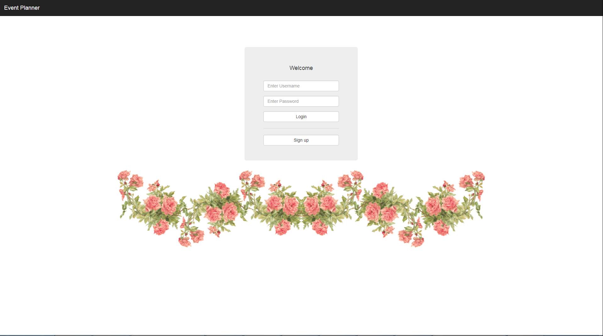

# Event Wedding Planner

## Class Information
### CMPE 281 Final Project - Chatbot section
- Fall 2017
- University Name: http://www.sjsu.edu/
- Course: Cloud Technologies (http://info.sjsu.edu/web-dbgen/catalog/courses/CMPE281.html)
- Professor Sanjay Garje (https://www.linkedin.com/in/sanjaygarje/)
- ISA: Divyankitha Urs (https://www.linkedin.com/in/divyankithaurs/)

### Team
- Sy Le (https://www.linkedin.com/in/syle1021/)
- Chidananda Pati (https://www.linkedin.com/in/chidananda-pati-87235356/)
- Shalini Narang
- Puja Kawale (https://www.linkedin.com/in/puja-kawale-126a1357)

### Project Introduction

Event-Planner is the trusted invitation service application. Its core feature is to to send event invitation to invitees along with sharing event pictures and providing comments on them.

### Urls
- (Demo Url)[http://eventplanner.themodestwhite.com]

### Sample Demo Screenshots

