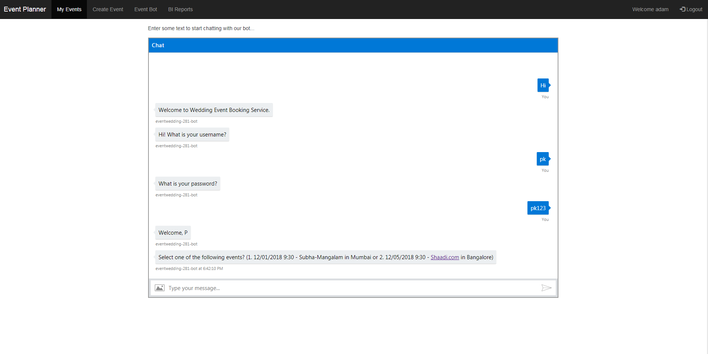

## CPM281_Cloud Technologies Project 2 for Cohort 9 SJSU-FALL-2017 by Group 11 

### Class Details
- Fall 2017
- University Name: http://www.sjsu.edu/
- Course: Cloud Technologies (http://info.sjsu.edu/web-dbgen/catalog/courses/CMPE281.html)
- Professor Sanjay Garje (https://www.linkedin.com/in/sanjaygarje/)
- ISA: Divyankitha Urs (https://www.linkedin.com/in/divyankithaurs/)

### Team members
#### GROUP 11
- Sy Le (https://www.linkedin.com/in/syle1021/)
- Chidananda Pati (https://www.linkedin.com/in/chidananda-pati-87235356/)
- Shalini Narang
- Puja Kawale (https://www.linkedin.com/in/puja-kawale-126a1357)

### Introduction to "Event Wedding Planner"
This Application platforms a polished and straightforward catering focused on the creation and sending of electronic invitations. Users can create an event, fill in information fields pertaining to their wedding event, build a guest list, and finally send the invitation via e-mail out to individuals using their email contact list. It also allows the user to upload event photos and comment on them.
Website - http://eventplanner.themodestwhite.com

### Application UI 

### Prereuisite Setup
To be able to run this project locally below pre-requisites are required to be made -
1)Register/create to an AWS account
2)Create an Amazon S3 bucket with defined security policies
3)Create and activate Amazon MySQL, RDS instance
4)Create Dynamo DB
5)Create an IAM previledged user, generate access tokens for this user.        
6)Softwares to download locally before running this application
  -java 8 SDK
  -Eclipse oxygen with STS
       
   * NOTE - Update application.properties file for below parameters -
       aws.access_key_id
       aws.secret_access_key
       s3.bucket
       s3.region
       s3.uploadfile
       s3.key
       server.port 
       spring.datasource.url 
       spring.datasource.username  
       spring.datasource.password 
       email.userName
       email.password
       twilio.acount_id
       twilio.auth_token

### Steps to run the project locally
-Download the source code from GIT and import it as a maven project into eclipse. When the project is imported the maven pom.xml will resolve and import all the dependencies. The dependencies include AWS SDK, Spring Boot.
-Run Project in eclipse as spring boot App
-Check the application on "http://localhost:"server.port"/event-planner/"

